# Skills

Agent-facing catalog and operating guide for the reusable skills in this repository.

If you are an AI agent that was directed to this repository because a user wants help finding, installing, updating, or testing a skill, **start with this README before choosing a skill**.

This repository contains reusable Agent Skills, meta-skills that create other skills, connector-backed operational skills, script-backed skills, user-specific knowledge skills, and a few supporting utilities that are not skills.

## Agent quick start

When a user asks for a skill from this repository:

1. **Understand the requested outcome.** Do not select a skill only because its folder name contains a matching word.
2. **Find the best candidate in the catalog below.** Prefer the narrowest skill that matches the requested work.
3. **Read the complete target `SKILL.md`.** The YAML `name` and `description` define the skill identity and trigger behavior. The body defines its operating contract.
4. **Read required supporting files.** If the skill references `references/`, `scripts/`, `agents/`, tests, templates, policies, or another skill, inspect the relevant files before installation or use.
5. **Check prerequisites and dependencies.** A skill can require Google Drive, an MCP server, a CLI, Python, credentials, a remote service, another skill, or a particular source-of-truth folder.
6. **Check for collisions.** Never overwrite or install a second skill with the same YAML `name` without understanding the conflict. This repository intentionally contains two variants named `codex-drive-as-knowledge`.
7. **Install the complete skill directory.** Do not copy only `SKILL.md` when the folder also contains required scripts, references, assets, or `agents/openai.yaml`.
8. **Do not confuse skill installation with runtime setup.** Installing a skill does not install Python packages, CLIs, MCP servers, credentials, OAuth connections, scheduled tasks, or generated child skills unless the skill and the user's request explicitly call for those actions.
9. **Verify discovery after installation.** Confirm the target host can see the installed skill by its YAML `name`. If the host indexes skills at startup and the change is not visible, restart or open a fresh session as appropriate.
10. **Run a safe smoke test.** Prefer read-only discovery, offline validation, or a harmless query. Do not send messages, mutate accounts, create cards, change infrastructure, schedule tasks, or perform another consequential action merely to prove a skill works.
11. **Run a behavioral test.** Invoke the skill explicitly and, when useful, try a prompt that should trigger it implicitly. Verify that it follows the expected source boundaries, dependencies, and safety rules.
12. **Report exact status.** Distinguish among: source found, files installed, skill discovered, dependency connected, static tests passed, live smoke test passed, and end-to-end behavior validated.

A copied directory is not proof that a skill works.

## What counts as a skill

A skill package is a directory containing a required `SKILL.md` and optional supporting resources such as:

```text
my-skill/
├── SKILL.md                 # required
├── agents/
│   └── openai.yaml          # optional UI/dependency metadata
├── scripts/                 # optional executable helpers
├── references/              # optional supporting documentation
├── assets/                  # optional templates/resources
└── tests/                   # optional repository tests
```

The complete directory is the installation unit when supporting files exist.

OpenAI's current skill documentation is the authoritative reference for host-specific behavior:

- https://learn.chatgpt.com/docs/build-skills
- https://help.openai.com/en/articles/20001066

Installation surfaces can change, so an agent should verify current official documentation when the exact UI or path matters.

## How to install a skill

### Codex

Preferred for a reusable skill from this repository:

1. Use the built-in `$skill-installer` when available.
2. Give it this repository and the **exact skill subdirectory**, not merely the repository root.
3. Preserve the complete directory.
4. Confirm the skill appears in `/skills` or can be mentioned with `$<skill-name>`.
5. If a newly installed or updated skill does not appear, restart Codex and verify again.

Example request to the installer:

```text
Use $skill-installer to install the skill from
https://github.com/eladrave/skills/tree/main/<skill-directory>
and preserve the complete skill directory.
```

For local/manual Codex authoring, current Codex documentation recognizes repository-scoped `.agents/skills` locations and the user-scoped `$HOME/.agents/skills` location. Repository scope is usually better for project-specific skills, while user scope is better for skills intended to be available across repositories.

Do not hard-code an older install path when the current Codex runtime or official documentation provides a different one.

### ChatGPT

Use the current Skills installation or upload flow available in the user's ChatGPT surface or workspace. Upload/install the complete skill package, not a detached `SKILL.md` when the skill depends on supporting files.

After installation:

1. Confirm the skill is visible in the Skills UI or available skill selector.
2. Invoke it explicitly with `@` when supported.
3. Run the safe smoke test listed in this README and any additional validation required by the skill itself.

Workspace policies can restrict skill creation, upload, installation, sharing, or connector access. Treat a successful upload as separate from successful dependency setup.

### Updating an installed skill

1. Read the currently installed version and the repository version.
2. Compare the full skill directories, not only `SKILL.md`.
3. Preserve local configuration or credentials that are intentionally stored outside the skill package.
4. Replace/update the skill only after resolving YAML-name collisions and material behavioral changes.
5. Re-run static, discovery, and smoke tests after the update.

Never put credentials into this repository merely to make a skill self-contained.

## How to test a skill

Use the following layers. Stop and report the blocker when a prerequisite is unavailable.

### 1. Package validation

Verify:

- `SKILL.md` exists and is readable.
- Frontmatter contains at least `name` and `description`.
- Every local file referenced by `SKILL.md` exists.
- Bundled Python scripts compile.
- Required executable/runtime versions are available.
- `agents/openai.yaml`, when present, is preserved with the package.

`creating-codex-custom-subagents/scripts/validate_skill.py` is a useful validator for Codex-style skills, but it is intentionally opinionated. In strict mode it treats warnings such as directory-name differences or descriptions that do not begin with `Use when` as failures. Do not use it as a universal repository-wide pass/fail gate without interpreting its findings.

### 2. Host discovery test

Verify the installed host can actually see the skill by its YAML `name`.

For Codex, use `/skills` or explicitly mention `$<skill-name>`. For ChatGPT, use the available Skills UI or explicit skill invocation.

### 3. Dependency test

Verify only the dependencies required by that skill, for example:

- Google Drive folder can be read.
- MCP server initializes and exposes the expected tools.
- CLI exists and reports a version.
- Python helper runs `--help` or an offline status command.
- Required credential is present without exposing it.

### 4. Safe functional smoke test

Use a read-only or offline operation whenever possible. The catalog below gives a recommended smoke test for every skill.

### 5. Behavioral trigger test

Test both when practical:

- **Positive:** a request that clearly should use the skill.
- **Negative:** a nearby request that should not use the skill.

For skills with side effects, a behavioral test does not need to execute the side effect. It can stop at preview, dry-run, discovery, or confirmation.

### 6. End-to-end test

Only when the user actually needs the operation, execute the real workflow under the skill's own confirmation and safety rules, then verify the observable result independently.

## Repository map

```text
skills/
├── ChatgptLibrary/
│   ├── DriveLibraryMetaSkill/           # retired general Library meta-skill
│   └── MedicalRecords/                  # retired standalone medical skill + old sync prompt
│
├── GoogleDriveAsResource/
│   ├── CodexAsKnowledgeReadWrite/       # operational Drive memory, read/write
│   ├── CodexAsknowledge/                # alternate read-only variant, same YAML name
│   ├── CynapsaDrive/                    # Cynapsa-specific Drive RAG
│   └── drive-folder-rag/                # generic Drive-folder RAG skill generator
│
├── SharedKnowledgeLibrary/              # current canonical general knowledge architecture
│   ├── SKILL.md
│   ├── _LIBRARY_POLICY.md
│   ├── bootstrap_migration.md
│   ├── manifest.example.json
│   └── scheduledprompt.md
│
├── StrandsAgents/                       # Strands Agents SDK engineering guide
├── TailScaleManagmet/                   # Tailscale Management API skill
├── amazon-transaction-mcp/              # Private Amazon orders/transactions MCP skill
│   └── plugin/                           # portable Codex/ChatGPT plugin marketplace + guide
├── billpayments/                        # Approval-gated bill payment orchestrator
├── creating-codex-custom-subagents/     # Codex subagent generator + validators/templates
├── creating-composio-mcp-servers/       # Composio MCP creation/configuration skill
├── litellm-agent-control-plane/         # LACP agent builder + API client
├── plivo/                               # Plivo MCP SMS/MMS/voice skill
├── plivowhatsapp/                       # Plivo WhatsApp helper + tests
├── privacy-cli/                         # Privacy.com CLI skill
├── privacymcp/                          # Privacy.com official MCP skill
├── remote-browser-access/               # Remote Browser MCP routing skill
├── simplefin-finance/                   # SimpleFIN read-only finance skill + tests
│
├── DroidDesk/                           # utility scripts, NOT a skill
└── docs/                                # design/supporting docs, NOT a skill
```

There are currently **19 `SKILL.md` files** in the repository, including the skill copy bundled
inside the Amazon Transaction MCP plugin.

## Architecture and selection rules

### Shared general knowledge

`SharedKnowledgeLibrary/SKILL.md` is the current primary general-library skill. Its architecture makes the Google Drive `ChatGPT Library` tree canonical and treats native ChatGPT Library as immediate-access/optional-ingress storage, not as a Drive mirror.

The `SharedKnowledgeLibrary/README.md` explicitly retires the older general-library approach represented by:

- `ChatgptLibrary/MedicalRecords`
- `ChatgptLibrary/DriveLibraryMetaSkill`

Keep those folders for historical or intentionally specialized workflows, but **do not select them for a new general SharedKnowledgeLibrary deployment** unless the user specifically wants the retired Drive-to-native-Library model.

`GoogleDriveAsResource/CynapsaDrive` remains useful when a narrowly scoped Cynapsa-only RAG skill is desired, but `SharedKnowledgeLibrary` already covers Cynapsa inside the canonical general library.

### Operational knowledge

Operational credentials, deployment/recovery runbooks, private infrastructure, MCP connection details, and similar agent-operating knowledge belong in the separate Google Drive `Codex` knowledge root.

`GoogleDriveAsResource/CodexAsKnowledgeReadWrite` is the broader read/write operational-memory variant. `GoogleDriveAsResource/CodexAsknowledge` is the read-only variant.

Both declare:

```yaml
name: codex-drive-as-knowledge
```

**Do not install both into the same skill scope unless the host is intentionally expected to expose two skills with the same name.** They are alternatives, not dependencies of one another.

### Alternative integrations

`privacy-cli` and `privacymcp` solve similar Privacy.com tasks through different integrations:

- Choose `privacymcp` when the official Privacy MCP server is the intended interface.
- Choose `privacy-cli` only when the user explicitly wants the official Privacy CLI workflow.

Do not silently fall back from one to the other.

`billpayments` is a separate foreground orchestration skill. It depends on the updated `privacymcp` credential-handoff exception and `remote-browser-access`; it may also use `shared-knowledge-library` for an explicitly requested billing profile. Installing `billpayments` without the coordinated `privacymcp` update leaves a material instruction conflict and must not be treated as a working payment setup.

`plivo` and `plivo-whatsapp` are also different:

- `plivo` uses a connected Plivo MCP for SMS, MMS, and voice.
- `plivo-whatsapp` uses the repository's Python helper and Plivo APIs/SDK for WhatsApp-specific workflows.

## Skill catalog

### Knowledge, Drive, and meta-skills

| Skill | Repository path | Status / use when | Important dependencies | Safe smoke test |
|---|---|---|---|---|
| `shared-knowledge-library` | [`SharedKnowledgeLibrary/`](SharedKnowledgeLibrary/) | **Current primary general-library architecture.** Use durable knowledge directly from the canonical Google Drive `ChatGPT Library` tree, keep operational Codex knowledge separate, and optionally ingest native-Library-only artifacts into Drive. | Google Drive access. For non-trivial writes/migration, also read the live library policy. | Read the canonical Drive root metadata and `_LIBRARY_POLICY.md`. Perform no write unless the user requested one. |
| `use-medical-records-library` | [`ChatgptLibrary/MedicalRecords/`](ChatgptLibrary/MedicalRecords/) | **Retired as a standalone general-library deployment by SharedKnowledgeLibrary.** Still documents a tightly scoped medical-record retrieval workflow against the canonical Drive subtree. | Google Drive access to the configured medical subtree. | List the canonical medical folder and retrieve one relevant document read-only. Do not rely on the legacy native Library mirror. |
| `cynapsa-knowledge` | [`GoogleDriveAsResource/CynapsaDrive/`](GoogleDriveAsResource/CynapsaDrive/) | Specialized Cynapsa-only Drive RAG. Use for source-grounded Cynapsa analysis, summaries, planning, comparisons, and document creation. | Google Drive access to the configured Cynapsa root. | Read the Cynapsa root metadata, list direct children, retrieve one clearly relevant document, and verify folder ancestry. |
| `codex-drive-as-knowledge` | [`GoogleDriveAsResource/CodexAsKnowledgeReadWrite/`](GoogleDriveAsResource/CodexAsKnowledgeReadWrite/) | Read/write shared operational memory for technical agents. Retrieves runbooks, URLs, connection details, constraints, and authorized credentials, and can maintain the canonical owner document after durable operational changes. | Google Drive access to the configured Codex root. | Read the Codex root and one non-secret applicable runbook. Do not write during smoke testing. |
| `codex-drive-as-knowledge` | [`GoogleDriveAsResource/CodexAsknowledge/`](GoogleDriveAsResource/CodexAsknowledge/) | Alternate read-only operational-memory variant. Same YAML name as the read/write variant. | Google Drive access to the same Codex root. | Read the Codex root and one applicable non-secret runbook. Verify no Drive mutation occurs. |
| `drive-folder-rag` | [`GoogleDriveAsResource/drive-folder-rag/`](GoogleDriveAsResource/drive-folder-rag/) | **Meta-skill.** Given a full Drive folder URL, validates the actual folder and generates a folder-specific RAG `SKILL.md`. Draft-only until explicit installation authorization. | Google Drive connector with access to the source folder. | Use a harmless accessible Drive folder URL and verify it generates a complete draft with the verified folder name/ID, but installs nothing. |
| `drive-library-skill` | [`ChatgptLibrary/DriveLibraryMetaSkill/`](ChatgptLibrary/DriveLibraryMetaSkill/) | **Legacy/special-purpose meta-skill.** Generates a folder-specific native ChatGPT Library reference skill plus a scheduled Drive-to-Library mirror prompt. SharedKnowledgeLibrary retires this model for the general library. | Google Drive plus native ChatGPT Library and scheduled-task capability if actually deployed. | Give it an accessible Drive folder and verify it produces the two drafts only. Confirm no skill, sync, or scheduled task is installed. |

### Agent engineering and orchestration

| Skill | Repository path | Use when | Important dependencies | Safe smoke test |
|---|---|---|---|---|
| `building-strands-agents` | [`StrandsAgents/`](StrandsAgents/) | Design, implement, test, expose, or consume Python agents built with the Strands Agents SDK, including tools, providers, Graph, Swarm, A2A, sessions, APIs, and deployment. | Python project and current Strands documentation. Runtime package installation depends on the target project. | Explicitly invoke the skill for a small Strands design question and verify it chooses an appropriate architecture and calls out current-version verification. No external mutation is needed. |
| `creating-codex-custom-subagents` | [`creating-codex-custom-subagents/`](creating-codex-custom-subagents/) | Design, create, install, validate, and behaviorally test reusable Codex subagents, companion skills, scripts, MCP dependencies, and hooks. | Codex plus the bundled templates/references/validators. MCP dependencies only when the generated agent needs them. | Run the bundled validators on a disposable/sample agent package, then spawn it in a fresh Codex session and test positive selection, negative selection, missing input, and permissions. |
| `creating-composio-mcp-servers` | [`creating-composio-mcp-servers/`](creating-composio-mcp-servers/) | Create/configure/authenticate/verify Composio-backed MCP endpoints for one or more toolkits. Prefers session-backed MCP and least-privilege tool allowlists. | Composio project access/API key, toolkit auth, network access. | Inspect toolkit/auth configuration, create no destructive action, then verify MCP initialization and `tools/list`. If functional testing is requested, use one harmless read-only tool. |
| `lacp-agent-builder` | [`litellm-agent-control-plane/`](litellm-agent-control-plane/) | Build, test, back up, restore, and manage agents on a remote LiteLLM Agent Control Plane, including MCP registration and multi-agent topology. | Python, reachable LACP REST endpoint, authorized LACP key stored securely. | Run `python3 litellm-agent-control-plane/scripts/lacp_client.py --help`, then `status --profile <profile>` and `inventory --profile <profile>`. Keep create/restore operations in dry-run unless explicitly approved. |

### Operations and integrations

| Skill | Repository path | Use when | Important dependencies | Safe smoke test |
|---|---|---|---|---|
| `amazon-transaction-mcp` | [`amazon-transaction-mcp/`](amazon-transaction-mcp/) ([plugin install guide](amazon-transaction-mcp/plugin/readme.md)) | Retrieve private Amazon orders, item prices, shipments, and payment transactions while handling expired login, MFA, bounded retries, pagination, and short MCP client timeouts. | Connected and authorized private Amazon Transaction MCP. | Call `amazon_auth_status(check_live=false)`, then make one bounded read such as `amazon_list_orders(time_filter="last7", all_pages=false, full_details=false)`. Do not expose credentials, tokens, cookies, or OTP values. |
| `billpayments` | [`billpayments/`](billpayments/) | Review and pay an ordinary verified bill in an interactive foreground session using a limited Privacy single-use card and Remote Browser, with separate authorization for card creation/credential transmission and final payment submission. | Updated `privacymcp`, `remote-browser-access`, official Privacy MCP, callable Remote Browser tools, and optional `shared-knowledge-library` access for a billing profile. | Validate package structure and run a behavioral preview that stops before card creation, PAN retrieval, browser credential entry, or payment submission. Never make a real payment as a smoke test. |
| `tailscale-management` | [`TailScaleManagmet/`](TailScaleManagmet/) | Inspect or manage the configured Tailscale tailnet through the Management API, including devices, routes, exit nodes, DNS, ACL/policy, users, keys, webhooks, services, and settings. | `codex-drive-as-knowledge`, Google Drive access to the pinned `TailScale.md` runbook, current Tailscale API access. | Load the authoritative runbook without exposing its credential, then perform the documented read-only API preflight or device-list call. Do not mutate Tailscale as a smoke test. |
| `plivo` | [`plivo/`](plivo/) | Use a connected Plivo MCP to find/select a sender and operate SMS, MMS, and voice. Live MCP schemas and enums are authoritative. | Connected/authenticated Plivo MCP, persistent memory if cross-session sender reuse is desired. | Discover enabled actions and live schemas, enumerate sender-number capabilities, and stop before sending anything. |
| `plivo-whatsapp` | [`plivowhatsapp/`](plivowhatsapp/) | Configure and use Plivo WhatsApp safely, including template synchronization/search, freeform/template sends, and delivery checks. | Python. Live sending requires Plivo credentials and the official SDK, installed only under the skill's consent workflow. | Run `python3 -m pytest plivowhatsapp/tests` when `pytest` is available, plus `python3 plivowhatsapp/scripts/plivo_whatsapp.py template inspect-text --text 'Hello {{1}}'`. No message is sent. |
| `privacy-cli` | [`privacy-cli/`](privacy-cli/) | Manage Privacy.com through the official `@privacy-com/privacy-cli`, including cards, limits, PAN retrieval, and transactions, under strict financial confirmations. | Node/npm and the official Privacy CLI, plus Privacy authentication. CLI installation/upgrade itself requires explicit user approval under the skill. | Run `privacy --version`. After authentication is configured, use `privacy cards list --page-size 1 --json`. Do not create/update/close a card as a smoke test. |
| `privacymcp` | [`privacymcp/`](privacymcp/) | Manage/analyze Privacy.com exclusively through the official Privacy MCP server. This is the MCP alternative to `privacy-cli`. | Official Privacy MCP connection, preferably OAuth. | Initialize/discover live tools, then use a read-only `list_cards` or equivalent live capability. Do not call `get_pan` or mutate a card for testing. |
| `remote-browser-access` | [`remote-browser-access/`](remote-browser-access/) | Route Amazon work and blocked/authenticated website work through the Remote Browser MCP/plugin. | Callable Remote Browser tools and an authorized remote browser session. | List browser tabs and take an accessibility snapshot of a benign existing tab. For Amazon, navigate only to the home page if needed. Do not purchase, submit, or delete anything. |
| `simplefin-finance` | [`simplefin-finance/`](simplefin-finance/) | Read and analyze the user's own SimpleFIN balances and transactions. Read-only by design, with secure persistence for the Access URL. | Python 3.11+, outbound HTTPS, SimpleFIN access, durable secure credential/file backend for setup. | Run `python3 -m unittest discover -s simplefin-finance/tests -p 'test_*.py'` and `python3 simplefin-finance/scripts/simplefin.py status`. If already configured, `accounts` is the safe live read test. |

## Bundled validation and test commands

### `creating-codex-custom-subagents`

The skill includes three validators:

```bash
python3 creating-codex-custom-subagents/scripts/validate_agent.py /path/to/agent.toml --strict
python3 creating-codex-custom-subagents/scripts/validate_skill.py /path/to/companion-skill --strict
python3 creating-codex-custom-subagents/scripts/validate_mcp.py /path/to/agent.toml --check-environment --strict
```

Use them for the generated bundle they were designed to validate. Follow with a fresh Codex runtime test. Static validation alone is not proof that a subagent or MCP server works.

### `plivo-whatsapp`

Repository tests use `pytest`:

```bash
python3 -m pytest plivowhatsapp/tests
```

Offline helper smoke test:

```bash
python3 plivowhatsapp/scripts/plivo_whatsapp.py template inspect-text \
  --text 'The task {{1}} was completed.'
```

Live sends are not test operations. They require the skill's preview and confirmation workflow.

### `simplefin-finance`

The bundled tests use Python `unittest` and do not require real banking credentials:

```bash
python3 -m unittest discover -s simplefin-finance/tests -p 'test_*.py'
```

Then check local/runtime configuration without exposing credentials:

```bash
python3 simplefin-finance/scripts/simplefin.py status
```

Only run a live `accounts` request when SimpleFIN is already securely configured or after completing the skill's persistence-first setup flow.

### `litellm-agent-control-plane`

Offline/helper discovery:

```bash
python3 litellm-agent-control-plane/scripts/lacp_client.py --help
```

Connected read-only checks:

```bash
python3 litellm-agent-control-plane/scripts/lacp_client.py status --profile default
python3 litellm-agent-control-plane/scripts/lacp_client.py inventory --profile default
```

Agent creation, MCP registration, restore, or other apply operations must remain in preview/dry-run until the skill's explicit confirmation boundary is satisfied.

## Dependency relationships

```mermaid
graph TD
    SKL[shared-knowledge-library] --> GDL[Google Drive: ChatGPT Library]
    MED[use-medical-records-library] -. retired standalone path .-> GDL
    CYN[cynapsa-knowledge] --> GDL

    CDRW[codex-drive-as-knowledge: read/write] --> CD[Google Drive: Codex]
    CDRO[codex-drive-as-knowledge: read-only] --> CD
    TS[tailscale-management] --> CDRW
    TS --> TAPI[Tailscale Management API]

    DFR[drive-folder-rag] --> GENR[Generated folder-specific RAG skill]
    DLM[drive-library-skill] --> GENL[Generated reference skill + sync prompt]

    PL[plivo] --> PMCP[Plivo MCP]
    PW[plivo-whatsapp] --> PSDK[Plivo SDK/API]
    PCM[privacymcp] --> PRMCP[Privacy MCP]
    PCLI[privacy-cli] --> PRCLI[Privacy CLI]
    RB[remote-browser-access] --> RBMCP[Remote Browser MCP]
    BP[billpayments] --> PCM
    BP --> RB
    BP -. optional billing profile .-> SKL
    SF[simplefin-finance] --> SFB[SimpleFIN Bridge]
    LACP[lacp-agent-builder] --> LAPI[LACP REST API]
```



Dashed legacy/meta relationships do not imply that installation should happen automatically.

## Important skill-specific cautions

### Do not install everything by default

Several skills are user/environment specific and contain fixed source boundaries or assumptions. Install only the minimum set needed for the requested workflow.

Before sharing a user-specific skill with another user or workspace, review and adapt hard-coded Drive roots, tailnet identifiers, account assumptions, private service references, and operational policies.

### Generated skills are separate artifacts

`drive-folder-rag` and `drive-library-skill` are meta-skills. Installing a meta-skill does **not** install the child skill it later generates.

Follow the generated-skill approval boundary in the meta-skill before installing the result.

### Connectors are separate from skills

Installing `plivo`, `privacymcp`, `remote-browser-access`, a Drive-backed skill, or another connector-dependent skill does not connect that service.

Verify the connector independently. If authentication/reconnection is required, report that exact blocker instead of claiming the skill failed.

### Credentials are never part of installation

Do not copy secrets from source documents, chat history, local profiles, or another environment into the skill directory.

Credentials should remain in the mechanism specified by the skill, for example OAuth, a connector, an approved secret backend, a protected local config file, or the canonical private operational knowledge source.

### Never use a consequential action as a smoke test

Examples of bad smoke tests:

- sending an SMS, WhatsApp message, or email;
- creating, pausing, or closing a Privacy card;
- revealing PAN/CVV;
- changing Tailscale routes, DNS, policy, users, or keys;
- creating/enabling an LACP agent;
- installing a generated child skill without approval;
- creating a scheduled sync task;
- making a purchase or submitting a website form.

Use read-only discovery, preview, dry-run, validation, or a sandbox/disposable test instead.

## Recommended selection examples

### “I need a skill that can use a Drive folder as a knowledge base”

Use `drive-folder-rag` to generate a dedicated folder-specific RAG skill. Install the generated skill only after the user explicitly approves it.

If the folder belongs under the user's canonical general `ChatGPT Library`, prefer `shared-knowledge-library` rather than creating another redundant general-library skill.

### “Use my shared Library / Medical records / general knowledge”

Use `shared-knowledge-library` for the current architecture.

Do not choose the retired Drive-to-native-Library mirror workflow just because `ChatgptLibrary/MedicalRecords` exists in the repository.

### “Use my operational runbooks, credentials, hostnames, and deployment instructions”

Use `codex-drive-as-knowledge` from `GoogleDriveAsResource/CodexAsKnowledgeReadWrite` unless the user specifically wants the read-only variant.

### “Manage my Tailscale”

Install/use:

1. `codex-drive-as-knowledge` read/write variant, if not already installed.
2. `tailscale-management`.

Then verify Drive access to its authoritative runbook and perform a read-only Tailscale API preflight before any requested mutation.

### “Create a Codex subagent”

Use `creating-codex-custom-subagents`. Preserve its entire directory because the skill depends on bundled references and validator scripts.

### “Build an agent with AWS Strands”

Use `building-strands-agents`. This skill is engineering guidance. Installing it does not install `strands-agents` into the target Python project.

### “Set up a Composio MCP server”

Use `creating-composio-mcp-servers`. Keep the Composio project key out of the repository and use the skill's least-privilege and read-only verification flow.

### “Use Privacy.com”

Choose exactly the requested interface:

- `privacymcp` for the official Privacy MCP workflow.
- `privacy-cli` for the official Privacy CLI workflow.

### “Pay this bill with a Privacy virtual card”

Use all of:

1. `billpayments`.
2. The coordinated updated version of `privacymcp`.
3. `remote-browser-access`.
4. `shared-knowledge-library` only when the user explicitly wants an existing billing profile retrieved from the canonical Drive library.

Keep the workflow foreground and interactive. Stop at the first authorization boundary during testing. Never create a card, retrieve PAN/CVV, fill a live payment form, or submit a payment merely to validate installation.

### “Use Amazon or my logged-in remote Chrome”

Use `remote-browser-access`. For Amazon, the skill intentionally routes to Remote Browser from the start.

### “Analyze my SimpleFIN accounts”

Use `simplefin-finance`. Run the offline unit tests and `status` first. The skill is read-only and must never claim it can move money or edit transactions.

## How an agent should report an installation

A good completion report should look like this:

```text
Selected skill(s):
- <yaml-name> from <repository path>
- <dependency skill>, if any

Reason:
- <why these skills match the request>

Installed to:
- <actual host/scope/location or Skills surface>

Dependencies:
- <connected/verified/missing>

Validation:
- Package structure: PASS/FAIL
- Skill discovered by host: PASS/FAIL
- Offline/static tests: PASS/FAIL/NOT APPLICABLE
- Read-only live smoke test: PASS/FAIL/NOT RUN
- Behavioral trigger test: PASS/FAIL/NOT RUN

Limitations or next action:
- <only if something remains>
```

Do not collapse these into “installed successfully” when only the files were copied.

## Non-skill folders

### `DroidDesk/`

Android/Linux desktop setup and helper scripts. It does not contain `SKILL.md`, so **do not install it as an Agent Skill**. Use its own README and scripts when the user specifically asks for that setup.

### `docs/`

Design/reference material, including Privacy MCP design notes. It is supporting documentation, not an installable skill unless a future subfolder gains its own `SKILL.md`.

## Maintaining this catalog

When adding, renaming, retiring, or materially changing a skill:

1. Update this README in the same change.
2. Keep the catalog path and YAML `name` accurate.
3. Add or update the safe smoke test.
4. Document new prerequisites and cross-skill dependencies.
5. Flag intentional duplicate YAML names.
6. Mark retired skills clearly instead of silently deleting historical workflows when they may still be useful.
7. Prefer tests that are offline or read-only by default.
8. Never add credentials or secret values to examples or fixtures.

The purpose of this README is to let an agent reliably answer three questions before acting:

1. **Which skill should I use?**
2. **What exactly must I install or connect?**
3. **How do I prove it works without causing unintended side effects?**
